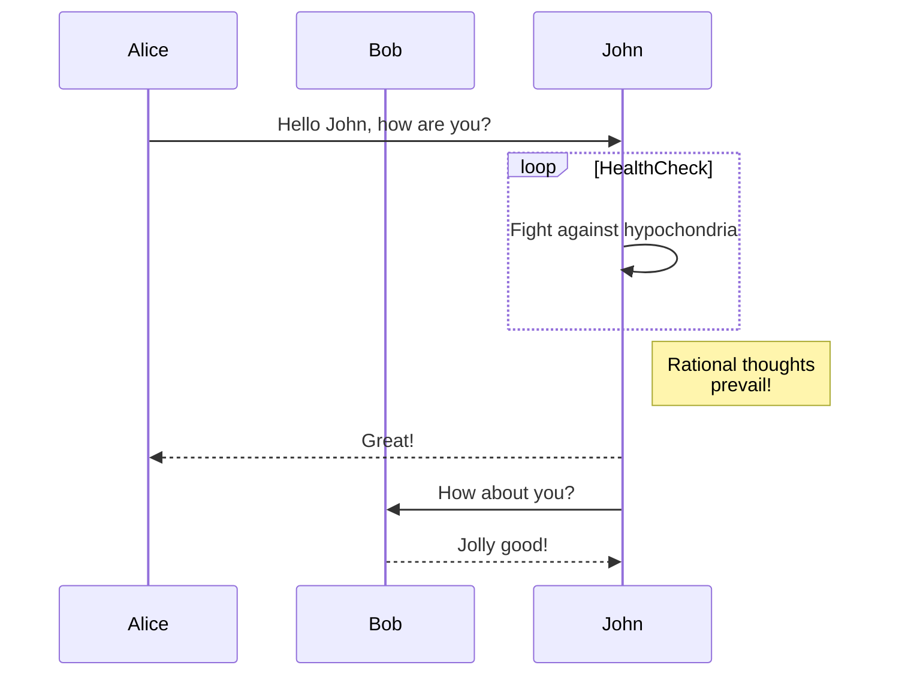
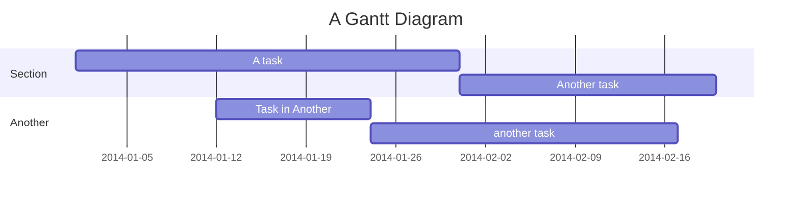

# Mermaid Flowcharts

> *Mermaid is the rendering engine for creating and displaying flowcharts inside of markdown. Mermaid is supported both by GitHub and by Typora.*

---

## Table of Contents

- [Mermaid Graph Types](#mermaid-graph-types)
  - [Flowchart](#flowchart)
  - [Sequence Diagram](#sequence-diagram)
  - [Gantt diagrams](#gantt-diagrams)
- [Viewing the help pages](#viewing-the-help-pages)
- [Displaying Mermaid Version](#displaying-mermaid-version)

## Mermaid Graph Types

Mermaid supports many different types of graphs and flowcharts.

For a full description of all of the graph types 
*See here*: https://mermaid.js.org/intro/

---

### [Flowchart](https://mermaid.js.org/syntax/flowchart.html?id=flowcharts-basic-syntax)

Flowcharts are composed of **nodes** (geometric shapes) and **edges** (arrows or lines). The Mermaid code defines how nodes and edges are made and accommodates different arrow types, multi-directional arrows, and any linking to and from subgraphs.

*Input:*

```
graph TD;
    A-->B;
    A-->C;
    B-->D;
    C-->D;
```

*Output:*


---

### [Sequence Diagram](https://mermaid.js.org/syntax/sequenceDiagram.html)

A Sequence diagram is an interaction diagram that shows how processes operate with one another and in what order.

*Input:*

```
sequenceDiagram
    participant Alice
    participant Bob
    Alice->>John: Hello John, how are you?
    loop HealthCheck
        John->>John: Fight against hypochondria
    end
    Note right of John: Rational thoughts <br/>prevail!
    John-->>Alice: Great!
    John->>Bob: How about you?
    Bob-->>John: Jolly good!
```

*Output:*



---

### Gantt diagrams

A Gantt chart is a type of bar chart, first developed by Karol Adamiecki in 1896, and independently by Henry Gantt in the 1910s, that illustrates a project schedule and the amount of time it would take for any one project to finish. Gantt charts illustrate number of days between the start and finish dates of the terminal elements and summary elements of a project

*Input:*

```
gantt
    title A Gantt Diagram
    dateFormat YYYY-MM-DD
    section Section
        A task          :a1, 2014-01-01, 30d
        Another task    :after a1, 20d
    section Another
        Task in Another :2014-01-12, 12d
        another task    :24d
```

*Output:*



---

## Viewing the help pages

- Help Page Link: https://mermaid.js.org/intro/

----

### Displaying Mermaid Version

Simply type `info` inside of a `mermaid` codeblock.
